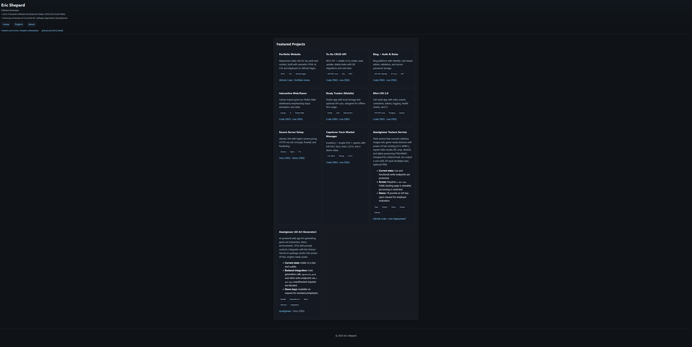

# Portfolio Website — Eric Shepard

Responsive static portfolio showcasing my projects, skills, and education.  
Built with **semantic HTML**, **modern CSS**, and deployed on **GitHub Pages**.

**Live Site**: https://emscode82.github.io

---

## 🚀 Features
- Responsive layout (mobile → desktop)
- Semantic HTML for accessibility & SEO
- Clean CSS with Flexbox/Grid
- Skip-link navigation for screen readers
- Project cards featuring:
  - Assetgineer — asset preparation pipeline: https://assetgineer.com
  - Texture Resizer Service — Flask texture pipeline: https://web-production-ec376.up.railway.app
  - Additional full-stack, mobile, and enterprise projects

---

## 🖼 Preview
Screenshots of navigation pages:

---

## 🛠 Tech Stack
- HTML5
- CSS3 (Grid, Flexbox, media queries, clamp)
- GitHub Pages for hosting

---

## 📂 Repo Structure
    /index.html      → Homepage
    /about.html      → Bio, education, skills
    /projects.html   → Project showcase
    /style.css       → Global stylesheet
    /README.md       → This file

---

## 💻 Run Locally
    # Clone the repo
    git clone https://github.com/EmsCode82/EmsCode82.github.io
    cd EmsCode82.github.io

    # Open index.html in your browser

---

## 📜 License
MIT License — free to use, adapt, and share with attribution.

---

👋 Built and maintained by **Eric Shepard**  
LinkedIn: https://www.linkedin.com/in/eric-shepard-softwaredev  
GitHub: https://github.com/EmsCode82
